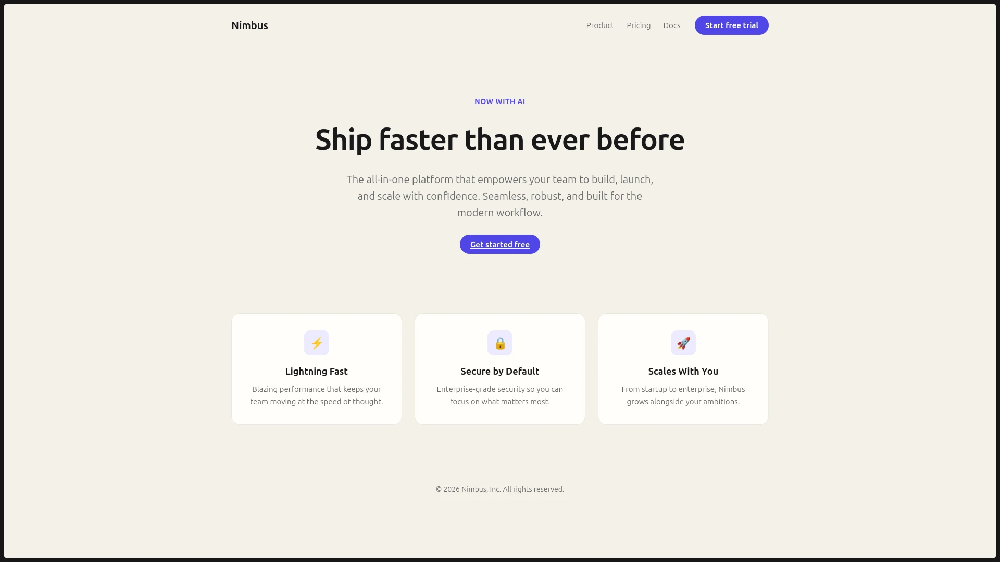
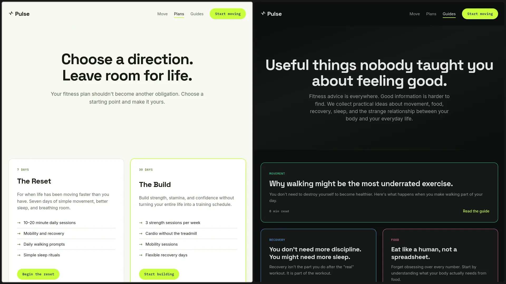

# Impeccable Demos

A small design-engineering playground for exploring [Impeccable](https://github.com/pbakaus/impeccable), an AI-assisted design critique skill.

The project starts with a deliberately ordinary SaaS fitness website called **Pulse**, then uses design critique and iteration to improve its visual hierarchy, spacing, typography, composition, and overall feel.

## Before → After

<table>
  <tr>
    <td width="50%"><strong>Before</strong></td>
    <td width="50%"><strong>After</strong></td>
  </tr>
  <tr>
    <td>
      
    </td>
    <td>
      
    </td>
  </tr>
</table>

The interesting part is the process: turning design critique into concrete frontend decisions.

## What's Inside

**Pulse** is a four-page static fitness site:

- Landing page
- Movement page
- Pricing page
- Guides & FAQ page

The design explores two visual directions:

- **Nimbus Dark** — near-black with electric lime
- **Clinical Light** — soft, spacious, and editorial

The project uses:

- HTML, CSS & JavaScript
- CSS custom properties
- Space Grotesk, Inter & IBM Plex Mono
- Responsive layouts
- Bento-style grids
- Impeccable design workflows

## Testing

The site includes a 30-test responsive and UI validation suite covering navigation, structure, responsiveness, and design outcomes.

**Result: 30/30 tests passing (100%)**, up from 52% before the design and frontend refinements.

## Impeccable Integration

The repository includes critique reports, surface briefs, and agent integrations for:

- Gemini
- Cursor
- Codex
- OpenCode
- Agents

Design artifacts live in:

```text
.impeccable/
```

The product direction and design system are documented in:

```text
PRODUCT.md
DESIGN.md
```

## Run It

No build step or dependencies are required.

```bash
cd median-page
python3 -m http.server
```

Then visit:

```text
http://localhost:8000
```

Or use any other static HTTP server.

## Project Structure

```text
.
├── PRODUCT.md
├── DESIGN.md
├── LICENSE
├── assets/
│   ├── impeccable-before.webp
│   └── impeccable-after.webp
├── median-page/
├── .impeccable/
├── .gemini/
├── .agents/
├── .cursor/
├── .codex/
└── .opencode/
```

## Why I Built This

I wanted to explore a simple question:

> Can AI-assisted design critique lead to better frontend decisions?

This project is a small experiment in combining **design thinking, frontend implementation, and AI-assisted development**.

## License

MIT